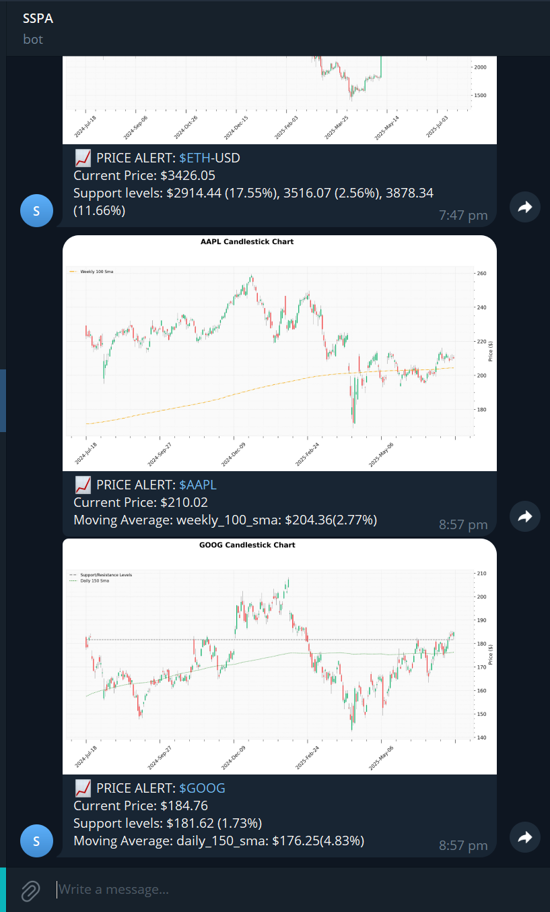
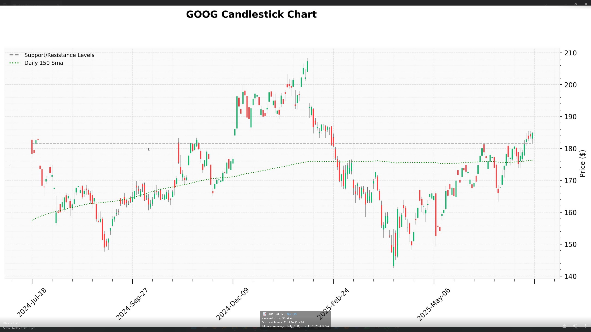
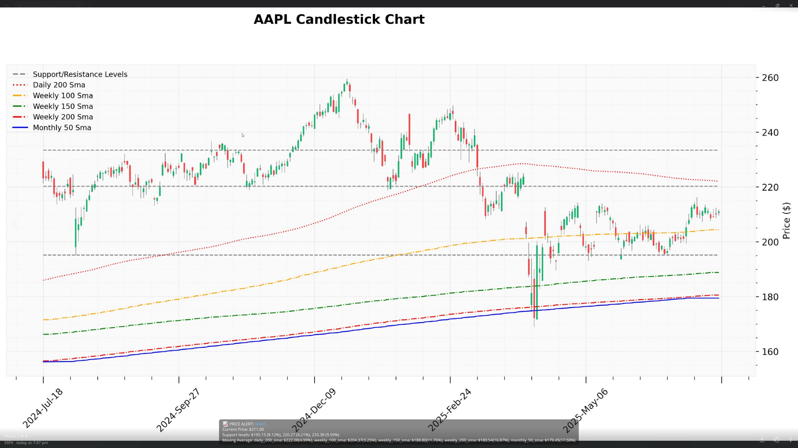

# 📈 Stock Price Alert Bot

This project is a Python-based stock analysis and alerting system that identifies buy signals based on support/resistance levels and moving averages. When a potential buy opportunity is detected, the bot generates a candlestick chart annotated with technical indicators and sends it via a Telegram bot.

## 🚀 Features

- Fetches historical stock data (daily, weekly, monthly) using `yfinance`
- Identifies support/resistance levels using peak detection and clustering (`scipy`, `sklearn`)
- Computes moving averages (50, 100, 150, 200) across multiple timeframes
- Generates annotated candlestick charts with `mplfinance`
- Sends chart and signal summary via Telegram
- Can be scheduled using GitHub Actions (CI/CD)
- Easily extendable and customizable

## 📊 Buy Signal Logic

A stock is considered a **buy signal** when:
- The current price is within a certain threshold above a support level
- The price is also near or above a long-term moving average
- (Optional) You can refine or add momentum indicators as needed

## 🔧 Project Structure

```
.
├── Main.py                 # Entry point: runs analysis and sends alerts
├── Stock.py                # Stock class for downloading and storing historical data
├── Supports.py             # Logic for finding and clustering support levels
├── MovAvg.py               # Logic for computing moving averages
├── Signals.py              # Logic for checking buy conditions
├── Plot.py                 # Candlestick plotting and annotation
├── TelegramMsg.py          # Handles Telegram messaging and image sending
├── image_cache/            # Temporary image storage for chart PNGs
├── requirements.txt        # Python dependencies
└── .github/workflows/
    └── check_stocks.yml    # GitHub Actions workflow to automate analysis
```

## 📦 Requirements

- Python 3.10+
- Dependencies:
  - `yfinance`
  - `pandas`
  - `matplotlib`
  - `mplfinance`
  - `scipy`
  - `scikit-learn`
  - `requests`

Install via:

```bash
pip install -r requirements.txt
```

## 🤖 Telegram Integration

To receive alerts via Telegram:

1. Create a Telegram bot with [BotFather](https://t.me/botfather)
2. Get your `TELEGRAM_BOT_TOKEN`
3. Get your `TELEGRAM_CHAT_ID` (You can use `@userinfobot`)
4. Add these secrets to GitHub or your environment:

```bash
export TELEGRAM_BOT_TOKEN='your_bot_token'
export TELEGRAM_CHAT_ID='your_chat_id'
```

## 🛠️ GitHub Actions Automation

The bot is scheduled to run daily using GitHub Actions:

```yaml
# .github/workflows/check_stocks.yml
on:
  schedule:
    - cron: '0 14 * * 1-5'  # Mon–Fri, 2 PM UTC
```

This workflow:
- Sets up Python
- Installs dependencies
- Runs your script
- Sends Telegram alerts for detected buy signals

## 🖼️ Example Output

The Telegram message includes:
- Annotated candlestick chart
- Support/resistance lines
- Moving averages
- Summary caption with the current price and signal score





## 🧹 Image Cleanup

The chart images are stored temporarily in `image_cache/` and automatically deleted after sending.

---

## 📈 Tickers Monitored

Update the `tickers` list in `Main.py` to track your preferred symbols:

```python
tickers = ['AAPL', 'NVDA', 'PLTR', 'GOOG', 'BTC-USD']
```

## 📬 Triggering Manually

Currently, the bot runs on a schedule, but you can add Telegram command support (e.g. `/run`) to trigger it manually by extending `TelegramMsg.py`.

---

## 🔮 Future Ideas

- Add more technical indicators (RSI, MACD)
- Allow dynamic ticker updates via Telegram commands
- Deploy on a server (e.g., AWS Lambda, Heroku) for real-time monitoring

---